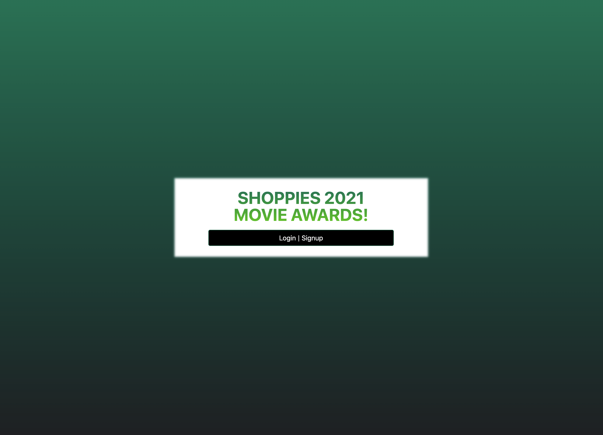
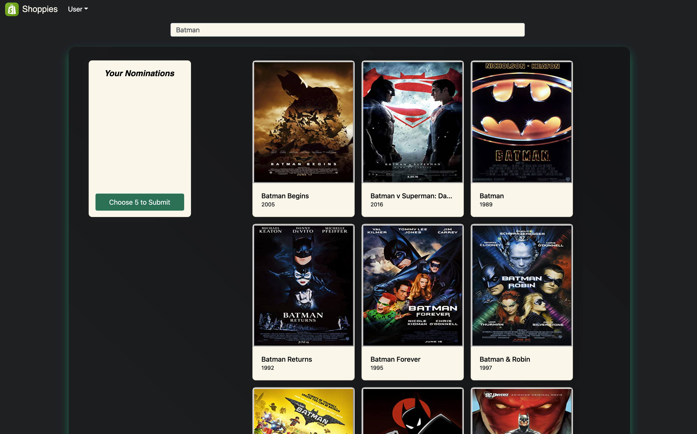
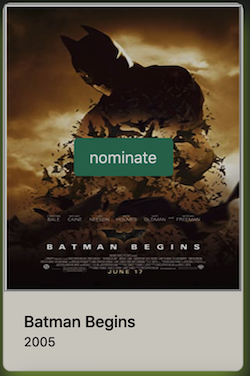
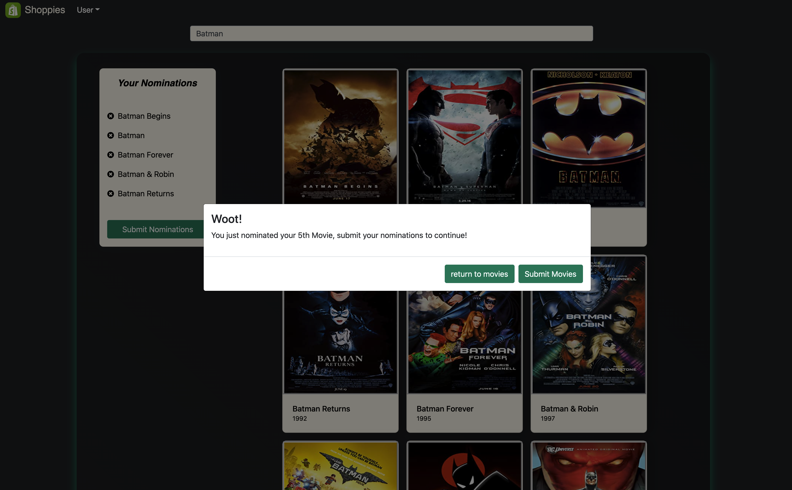
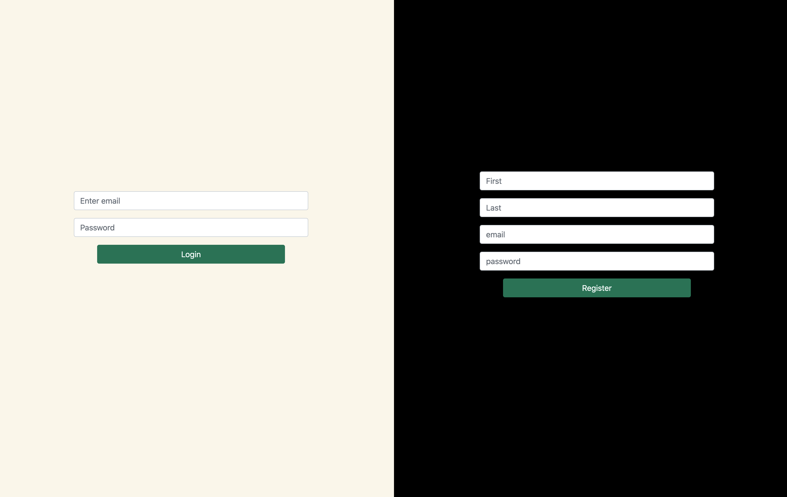
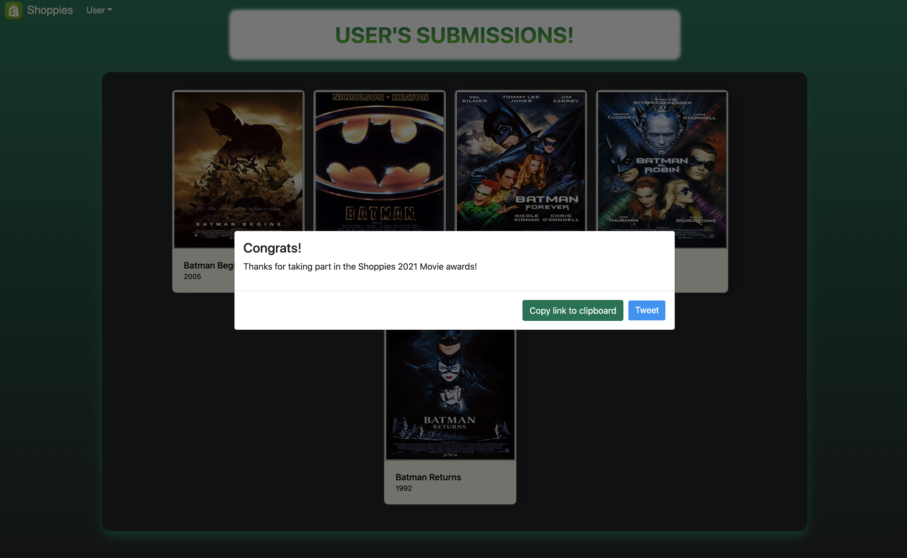

# Shopify-2021

* deployed at http://54.213.160.218/

Shopify job appication challenge:
A webpage that can search OMDB for movies, and allow the user to save their favourite films they feel should be up for nomination. When they've selected 5 nominees they should be notified they're finished.

The color scheme was pulled directly from shopify's website.

## Getting Started

These instructions will get you a copy of the project up and running on your local machine for development and testing purposes. See deployment for notes on how to deploy the project on a live system.

- Download files
- Get your own API key and place in a secrets.sh file like so `export APIKEY="yourkey"`
- Create .gitignore file and add secrets.sh
- If you use virtual environments then start one `$ virtualenv env`(initiate) `$ source env/bin/activate`(run)
- Source your secrets file `$ source secrets.sh` (every single time you open a new terminal)
- Download required packages by running ` $ pip3 install -r requirements.txt`
- Build database by running `$python3 seed_db.py`
- Launch your server! `python3 server.py`

### Requirements

* Search OMDB's API and display the results (movies only)

* Each search result should list at least its title, year of release and a button to nominate that film.
##### Movie title and year are shown below the movie poster, the movie can be nominated by hovering over the poster

* Movies in search results can be added and removed from the nomination list.
##### Movies can be added by hovering over the movie and selecting the "Nominate" button
##### Movies can be removed using the 'x' in list of nominations on the left of the screen

* If a search result has already been nominated, disable its nominate button.
##### Removed nomination button once movie has been nominatied rather than displaying one that said "Nominated"

* Display a banner when the user has 5 nominations.
##### The modal from setLastNominationModal.jsx is shown when the user nominates their last nomination
##### The modal in nominationLimitModal.jsx is is shown if a user attempts to nominate more than 5 movies

* Save nomination lists if the user leaves the page
##### When a user nominateds a movie, a HTTP request is sent to an API endpoint and saved to the database. The user nominations are then rendered from the database. This way every nominations is saved and accessible by the user at any time.

* Animations for loading, adding/deleting movies, notifications
##### Modals are used to notify the user when they have nominated their last nominations, or try to nominate too many

### User Story

* users will click the login|signup button to be taken to the make an account page
* users will choose to either login or signup, when a user creates and account the will recieve an alert to login

* once logged in users will may type into the search box to render movies
* to nominate a movie, a user can hover over the movie they want to nominate and a button will appear
* once a user has nominated 5 movies they will be notified and the option to submit will render
* once submitted a user will have an opportunity to see their nominations and share the app via link or twitter

## Built With

* React Hooks
* Python
* HTML
* CSS
* Bootstrap
* Flask
* SQLAlchemy

## Known Issues

* The search results don't always format well if there isn't a space after the movie title
* The search could be more intuitive, in the future I'd add clearer instructions or labels
* The profile doesn't always automatically revoke nominations privileges once a user has submit
* The tweet should be pre-filled with hastags and a clickable link (rather than plain text)
* The copy to clipboard could be more seemless
* I committed to my github before hiding the APIKEY and wasn't worried about this because it's free but would not do this in the future
* Some of the movie posters are different sizes so I'd like to build a design more suited to the images
* The shareable link should show the individuals nominations and not the homepage
* The site is not yet mobile friendly

## Sources used for shareable links

* https://codesandbox.io/s/react-hooks-counter-demo-forked-9lsol?file=/src/index.js:103-448
* https://img-9gag-fun.9cache.com/photo/agyx4Dn_700bwp.webp
* https://stackoverflow.com/questions/63546951/react-copy-to-clipboard-using-useref-hook
* https://developer.twitter.com/en/docs/twitter-for-websites/tweet-button/overview
* https://stackoverflow.com/questions/400212/how-do-i-copy-to-the-clipboard-in-javascript
